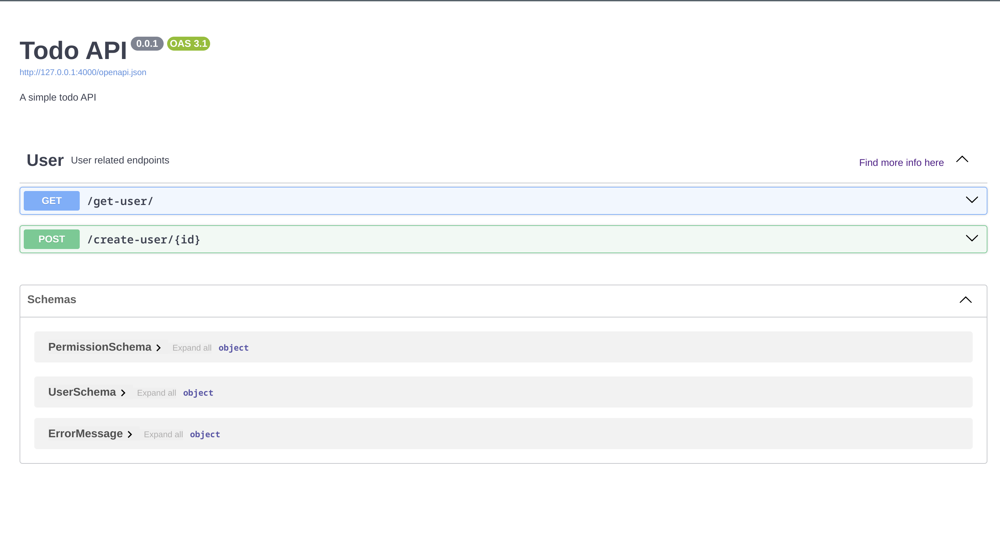

# Swagger, swagger there you are

Well, djapy, one of the finest piece of software I've ever written, has a swagger documentation.
It is flawless, it is perfect, it is beautiful.

Here's how it looks like:



And here's how you can use it:

```python
from django.urls import path
from djapy import openapi

openapi.set_basic_info(
    title="Todo API",
    description="A simple todo API",
    version="0.0.1",
    tags_info=[
        {"name": "Todos", "description": "Operations related to todos"}
    ]
)

urlpatterns = [
    ...
    path('', openapi.urls),
]
```

And that's it. You can now access your swagger documentation at the url you've set in your `urls.py` file.

## Tags and descriptions

You can add tags to whole endpoints in your `views.py` using the `TAGS` variable.

```python
TAGS = ["Todos"]


@djapify
def todo_list(request):
    ...
```

Also, you can assign tags specifically using `@djapigy` decorator.

```python
from djapy import djapify


@djapify(tags=["todos"])
def todo_list(request):
    ...
```

It's that simple.
