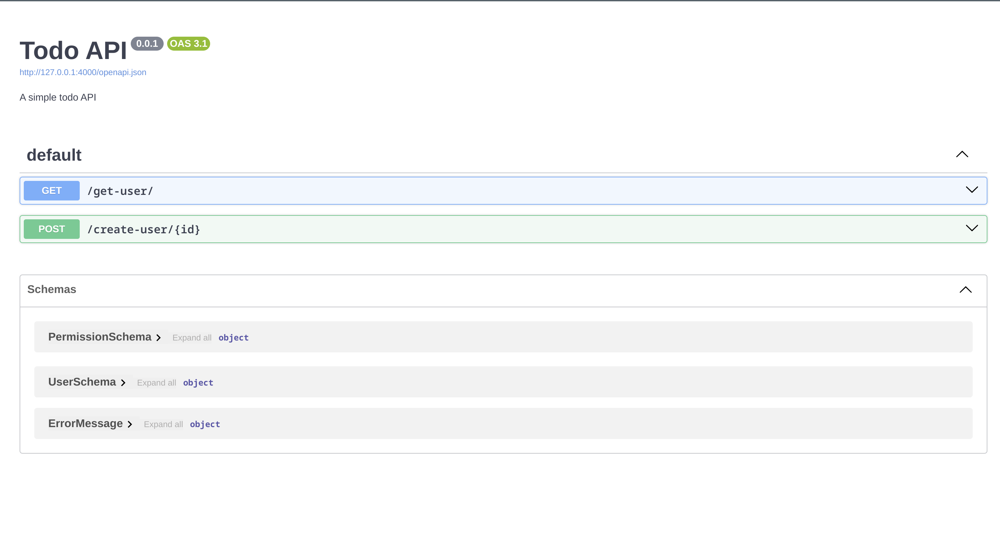

# Swagger, swagger there you are

Well, djapy, one of the finest piece of software I've ever written, has a swagger documentation.
It is flawless, it is perfect, it is beautiful.

Here's how it looks like:



And here's how you can use it:

```python
from django.urls import path
from djapy import openapi

openapi.set_basic_info(
    title="Todo API",
    description="A simple todo API",
    version="0.0.1"
)

urlpatterns = [
    ...
    path('', openapi.urls),
]
```

And that's it. You can now access your swagger documentation at the url you've set in your `urls.py` file.
